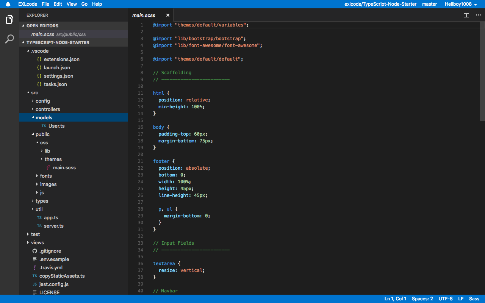
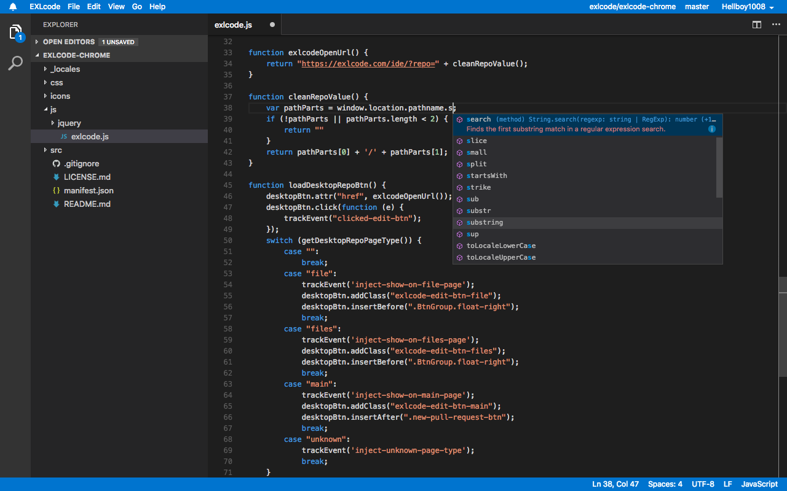
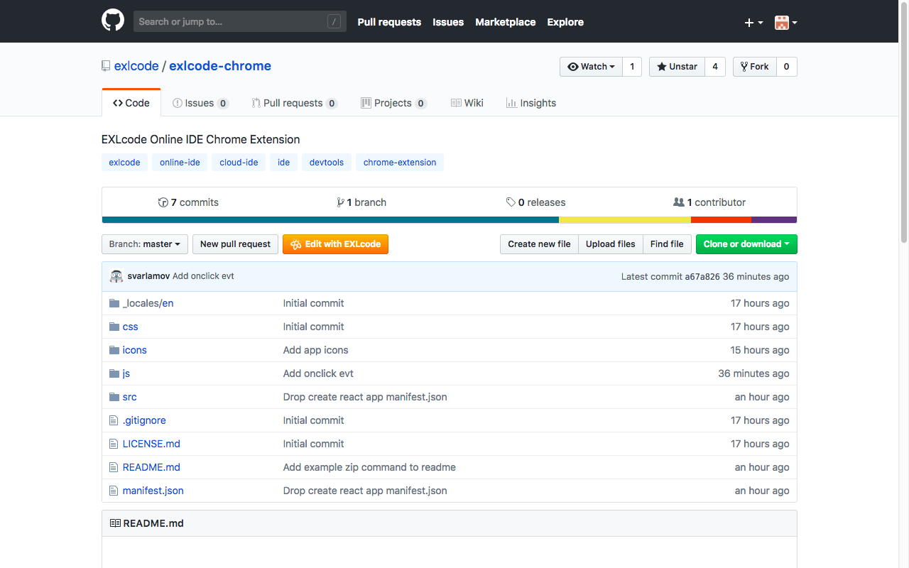

[](https://exlcode.com/)

EXLcode is an open source, MIT-licensed, cloud+browser-based fork of the VS Code core maintained by EXL Inc.

Try it out at https://exlcode.com/

Get the Chrome extension [here](https://chrome.google.com/webstore/detail/exlcode-vs-code-based-onl/elcfpiphmolcddmecegalaikjiclhdjc?hl=en).

Read the user docs [here](https://exlcode.com/documentation)

## EXLcode in Action

[](https://exlcode.com/)
[](https://exlcode.com/)
[](https://exlcode.com/)

## Features

<ul>
	<li>GitHub integration (view and edit repositories and files, <i>in place</i>)</li>
	<li>Chrome extension for seamlessly using EXLcode in your daily workflow</li>
	<li>Complete project explorer and text editor</li>
	<li>Syntax highlighting and auto-complete for all major programming and markup languages</li>
	<li>IntelliSense for Javascript, TypeScript, JSON</li>
	<li>Project-wide search and replace</li>
	<li>Fuzzy filename search</li>
	<li>Side-by-side file comparison</li>
	<li>Themes</li>
	<li>Customizable Keyboard Shortcuts</li>
	<li>Per-user, per-project customizable editor settings</li>
</ul>

## Developing

### Installing from Source

```bash
# Clone this repository.
git clone https://github.com/exlcode/exlcode

# Install npm packages
# Make sure that `which python` points to your installation python2 and that you have the build-essential package (on Ubuntu) for native builds and the xcode command line tools for OS X
# WHEN RUNNING ON A SERVER: For linux servers (no desktop), make sure you install X11 dev with `sudo apt-get install libx11-dev` otherwise the build will fail
# From the repo root, run:
./scripts/npm.sh install
cd ./exlcode
npm install

# Build
# From the repo root, run:
cd ./exlcode
npm run build

# Build targets:
# build - not minified, not optimized
# build-opt - packed not minimized. Requires ?b=opt when on localhost.
# build-min - packed and minimized. Requires ?b=min when on localhost.
```

### Running Locally

```bash
# From the root of the repo, run:
cd ./exlcode && npm run http-server
```

The IDE will then be available at [http://localhost:8000](http://localhost:8000)

## Contributing

If you are interested in fixing issues and contributing directly to the code base, you can setup your development environment following the steps above and check issues in this GitHub repo. Once your changes are ready, please submit a pull request in this repo for the team to review.

-   [Submit bugs and feature requests](https://github.com/exlcode/exlcode/issues) and help us verify as they are checked in
-   Review [source code changes](https://github.com/exlcode/exlcode/pulls)
-   Review the [documentation](https://exlcode.com/documentation) and open issues/PRs for anything from typos to new content

## Feedback

Please leave your feedback and bug reports in our [GitHub Issues](https://github.com/exlcode/exlcode/issues).

## Related Projects

-   [Chrome Extension Source](https://github.com/exlcode/exlcode-chrome) ([Download Chrome Extension](https://chrome.google.com/webstore/detail/exlcode-vs-code-based-onl/elcfpiphmolcddmecegalaikjiclhdjc?hl=en))

## License

[MIT](LICENSE.txt)
